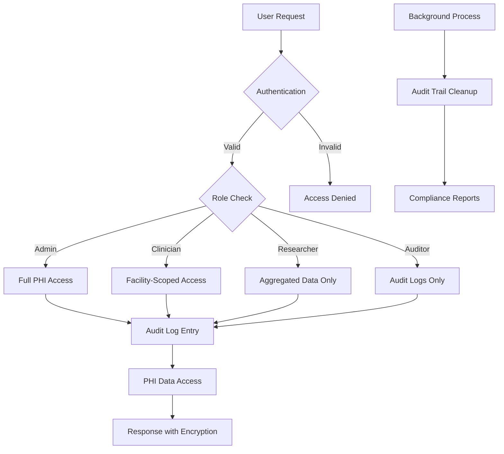

# PHI Data Access Controls and Audit Trails Implementation Plan

## Overview
This plan outlines the design and implementation of Protected Health Information (PHI) access controls and audit trails for the healthcare reporting application. The system handles sensitive patient data including HIV/AIDS treatment information, requiring compliance with healthcare privacy regulations.

## Current System Analysis
Based on the codebase analysis, the following PHI data fields have been identified:

### Patient Model (app/Models/Patient.php)
- `p_number` - Patient identifier
- `np_number` - National patient number
- `date_of_birth` - Date of birth
- `gender` - Gender information
- `height` - Physical characteristic
- `site_id` - Facility/site association

### InitialVisit Model (app/Models/InitialVisit.php)
- `patient_id` - Links to patient
- `first_positive_hiv` - HIV diagnosis date
- `who_stage` - WHO clinical stage
- `diagnosis_1-4` - Diagnosis codes
- `art_pre_exposure_id` - ART pre-exposure status
- `previous_tb_tt` - TB treatment history
- `art_start_place_id` - ART initiation location
- `art_start_date` - ART start date
- `cd4_baseline` - CD4 count baseline

### Visit Model (app/Models/Visit.php)
- `patient_id` - Patient identifier
- `facility_id` - Treatment facility
- `visit_type_id` - Type of visit
- `app_visit_date` - Appointment date
- `actual_visit_date` - Actual visit date
- `next_visit_date` - Next appointment
- `transfer_type_id` - Transfer status

## Compliance Standards
Assuming HIPAA compliance for US healthcare data protection, with potential GDPR considerations for international data handling.

## Implementation Components

### 1. User Roles and Permissions
- **Admin**: Full access to all PHI data, audit logs, and system configuration
- **Clinician**: Access to patient data for assigned facilities/sites, limited to necessary clinical information
- **Researcher**: Aggregated/de-identified data access only, no individual patient identifiers
- **Auditor**: Read-only access to audit logs and compliance reports

### 2. Role-Based Access Control (RBAC)
- Implement Laravel Policies for each model containing PHI
- Use Gates for fine-grained permissions on specific actions
- Database-level row security policies for multi-tenant data isolation

### 3. Data Encryption
- Encrypt PHI fields at rest using Laravel's encryption facilities
- Implement TLS 1.3 for data in transit
- Secure API endpoints with proper authentication

### 4. Audit Logging System
- Comprehensive logging of all PHI access and modifications
- Track: user, timestamp, action, resource, IP address, user agent
- Immutable audit trail with cryptographic integrity
- Retention period: 6 years minimum (HIPAA requirement)

### 5. Data Anonymization/Masking
- Implement data masking for reports and exports
- K-anonymity for research datasets
- Pseudonymization for longitudinal studies

### 6. Access Control Middleware
- Route-level middleware for PHI-protected endpoints
- Controller-level authorization checks
- Automatic audit logging on access attempts

## Architecture Diagram

## Implementation Phases

### Phase 1: Foundation (Week 1-2)
- Define user roles and permissions matrix
- Create database migrations for audit logs and user roles
- Implement basic RBAC policies

### Phase 2: Access Controls (Week 3-4)
- Add encryption to PHI fields
- Implement middleware and policies
- Update controllers with authorization checks

### Phase 3: Audit System (Week 5-6)
- Build audit logging infrastructure
- Add audit trails to all PHI operations
- Implement log retention and cleanup

### Phase 4: Data Protection (Week 7-8)
- Implement data anonymization
- Add export controls and masking
- Create compliance reporting

### Phase 5: Testing & Documentation (Week 9-10)
- Comprehensive security testing
- Penetration testing for PHI access
- Documentation and training materials

## Security Considerations
- Multi-factor authentication for all users
- Regular security audits and vulnerability assessments
- Incident response plan for PHI breaches
- Data backup encryption and secure storage

## Risk Mitigation
- Defense in depth approach with multiple security layers
- Regular compliance audits
- Automated alerts for suspicious access patterns
- Business continuity planning for data protection

## Success Metrics
- Zero unauthorized PHI access incidents
- 100% audit trail coverage for PHI operations
- Compliance with HIPAA/GDPR requirements
- User satisfaction with access controls balancing security and usability